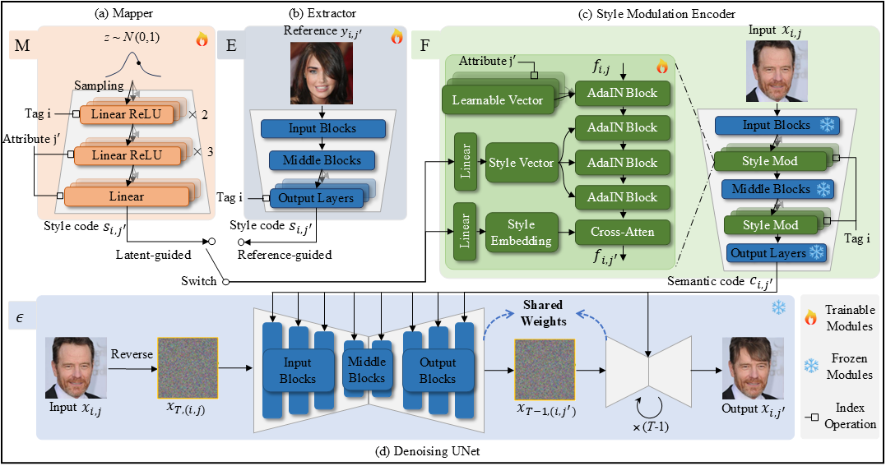

# LatRef-Diff
An PyTorch implementation of "LatRef-Diff:  Latent and Reference-Guided Diffusion for Facial Attribute Editing and Style Manipulation"

## Abstract
Facial attribute editing and style manipulation are crucial for applications like virtual avatars and photo editing. However, achieving precise control over facial attributes without altering unrelated features is challenging due to the complexity of facial structures and the strong correlations between attributes. While conditional GANs have shown progress, they are limited by accuracy issues and training instability. Diffusion models, though promising, face challenges in style manipulation due to the limited expressiveness of semantic directions. In this paper, we propose LatRef-Diff, a novel diffusion-based framework that addresses these limitations. We replace the traditional semantic directions in diffusion models with style codes and propose two methods for generating them: latent and reference guidance. Based on these style codes, we design a style modulation module that integrates them into the target image, enabling both random and customized style manipulation. This module incorporates learnable vectors, cross-attention mechanisms, and a hierarchical design to improve accuracy and image quality. Additionally, to enhance training stability while eliminating the need for paired images (e.g., before and after editing), we propose a forward-backward consistency training strategy. This strategy first removes the target attribute approximately using image-specific semantic directions and then restores it via style modulation, guided by perceptual and classification losses. Extensive experiments on CelebA-HQ demonstrate that LatRef-Diff achieves state-of-the-art performance in both qualitative and quantitative evaluations. Ablation studies validate the effectiveness of our model's design choices.

## Model
### Overview of the proposed LatRef-Diff.

## Pre-trained Model
The model checkpoint can be downloaded using [Google Drive link](https://drive.google.com/drive/folders/1RgHAGFYy-KvT266AV8SuSI2Gba9e5Ap1?usp=sharing). The checkpoint should be located in the path checkpoints/ffhq256_autoenc.

## Testing

python manipulate.py

## Ackonwledgements
This code refers to the following project:

[1] (https://https://github.com/konpatp/diffae)
